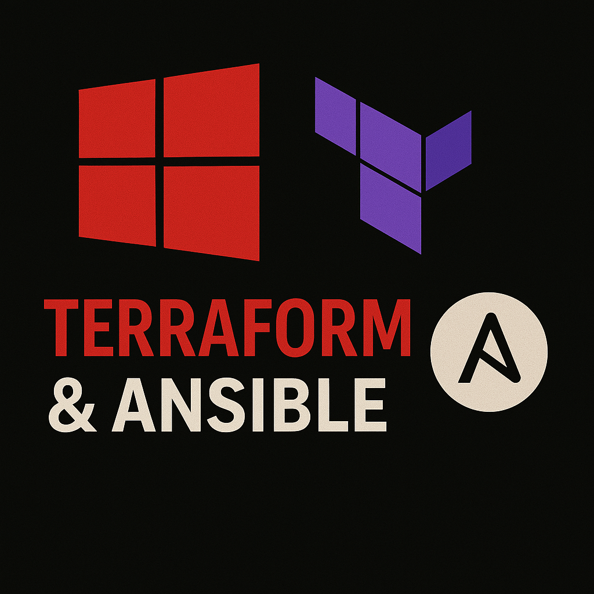

# azure-redteam-lab
<p align="center">
  
</p>

 
# Azure Red Team Lab — Terraform & Ansible

##Tech Stack

- [Terraform](https://www.terraform.io/) — Infrastructure provisioning
- [AzureRM Provider](https://registry.terraform.io/providers/hashicorp/azurerm/latest) — Manage Azure resources
- [Ansible (optional)](https://www.ansible.com/) — Post-deployment configuration (tools, decoy services, cleanup)
- [Havoc Framework](https://github.com/HavocFramework/Havoc) — *Security testing framework installed via Kali package manager*

##The what

- Azure Resource Group + VNet + Subnet
- Locked-down VM
- **Havoc C2**

##Requirements

- Azure account with Contributor access
- SSH keypair (add your public key to `terraform.tfvars`)
- [Terraform](https://developer.hashicorp.com/terraform/downloads)
- [Ansible (optional)](https://docs.ansible.com/)

##Usage

1. Clone this repo
2. Update the SSH public key in `terraform.tfvars` or use CLI input
3. Run:

   ```bash
   terraform init
   terraform apply
